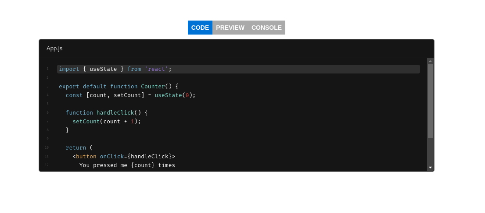

<div align="center">

# React Sandbox

⚡ by [OPEN TECH FOUNDATION](https://open-tech-foundation.pages.dev/)



</div>

> The [CodeSandbox](https://codesandbox.io/) sandpack wrapper with tabs layout.

## View Demo

- [CodeSandbox](https://codesandbox.io/s/react-sandbox-bcggdd)
- [Stackblitz](https://stackblitz.com/edit/vitejs-vite-ic6mks?file=src/App.jsx) (If preview is not working, try `Open in New Tab` button)

## Installation

Using npm

```sh
npm install @opentf/react-sandbox
```

Using Yarn

```sh
yarn add @opentf/react-sandbox
```

Using pnpm

```sh
pnpm add @opentf/react-sandbox
```

## Usage

```ts
import { SandBox } from '@opentf/react-sandbox';

export default function App() {
  const code = `export default function App() {
      return <h1>Hello world</h1>
    }
  `;

  return <SandBox code={code} />;
}
```

## Props

```ts
interface Props {
  code: string; // Template specific default file content
  deps?: string[]; // npm dependencies, eg: ['lodash']
  files?: Record<string, string>;
  template?:
    | 'react'
    | 'react-ts'
    | 'vanilla'
    | 'vanilla-ts'
    | 'static'
    | 'nextjs'
    | 'node'
    | 'vite'
    | 'vite-react'
    | 'vite-react-ts'; // Default "react"
  cdns?: string[]; // Any third party external dependencies, eg: ['https://cdn.tailwindcss.com']
  tabIndex?: number; // Default 0
}
```

## License

Copyright (c) [Thanga Ganapathy](https://github.com/Thanga-Ganapathy) ([MIT License](./LICENSE)).
