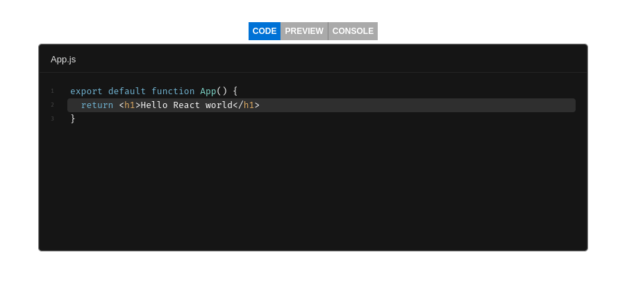

&nbsp;[OPEN TECH FOUNDATION](https://open-tech-foundation.pages.dev/)

<div align="center">

# React Sandbox



</div>

> The [CodeSandbox](https://codesandbox.io/) sandpack wrapper with additional features.

## View Demo

- [CodeSandbox](https://codesandbox.io/s/react-sandbox-bcggdd)
- [Stackblitz](https://stackblitz.com/edit/vitejs-vite-ic6mks?file=src/App.jsx) (If preview is not working, try `Open in New Tab` button)

## Features

- Multiple Layouts (`Tabs`, `Code+Console`, etc)
- Choose between console types: `Basic` or `Advanced`([console-feed](https://www.npmjs.com/package/console-feed))

## Installation

```sh
npm install @opentf/react-sandbox
```

```sh
yarn add @opentf/react-sandbox
```

```sh
pnpm add @opentf/react-sandbox
```

```sh
bun add @opentf/react-sandbox
```

## Usage

```ts
import { SandBox } from '@opentf/react-sandbox';

export default function App() {
  const code = `export default function App() {
    return <h1>Hello world</h1>
  }`;

  return <SandBox code={code} />;
}
```

## Props

| Name        | Type                   | Required | Default   | Description                                                                                                                           |
| ----------- | ---------------------- | -------- | --------- | ------------------------------------------------------------------------------------------------------------------------------------- |
| code        | string                 | Yes      | ''        | Template specific default file content <br /> Eg: `nextjs` -> `pages/index.js`                                                        |
| template    | string                 | No       | 'react'   | The codesandbox template.                                                                                                             |
| layout      | string                 | No       | 'Default' | Currently, there are three presets available: <br />1. `Default`<br /> 2.`Tabs`<br /> 3. `Code_Console`                               |
| deps        | string[]               | No       | []        | The npm dependencies.<br /> eg: ['lodash', 'immer@10.0.0'].                                                                           |
| files       | Record<string, string> | No       | {}        | The files prop accepts an object, where each key is the relative path of that file in the sandbox folder structure.                   |
| cdns        | string[]               | No       | []        | Any third party external dependencies, eg: ['https://cdn.tailwindcss.com']                                                            |
| tabIndex    | number                 | No       | 0         | The tab index to select in the `Tabs` layout                                                                                          |
| consoleType | string                 | No       | 'Basic'   | There are two types, `Basic` and `Advanced`. <br /> It uses [console-feed](https://www.npmjs.com/package/console-feed) for 'Advanced' |

## Related

- [react-node-repl](https://www.npmjs.com/package/@opentf/react-node-repl)

## License

Copyright (c) [Thanga Ganapathy](https://github.com/Thanga-Ganapathy) ([MIT License](./LICENSE)).
